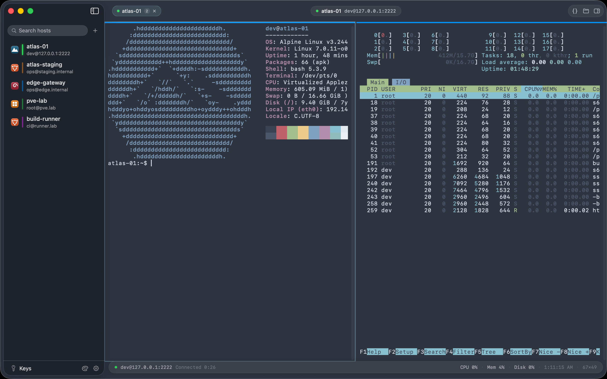

# Berth

**SSH, the Mac way.**

Berth is a Swift-native SSH client for macOS — Metal-rendered terminal, connection reuse, infinite split panes. Passwords and keys live in your Keychain; nothing ever leaves your Mac.



macOS 15+ · Apple Silicon & Intel · Developer ID signed & notarized

## Features

**Connection reuse & infinite splits.** ⌘T tabs and ⌘D splits share one SSH channel — no second handshake. Nest splits without limit; `exit` collapses the pane.

**Jump hosts & port forwarding.** Chain jump hosts end to end. Local, remote and dynamic SOCKS5 forwarding, plus outbound HTTP/SOCKS5 proxies and ssh-agent support.

**Keys & Touch ID.** Generate or import keys; Touch ID guards every private-key use. `known_hosts` pinning with loud alerts on fingerprint changes.

**SFTP file panel.** Rides the session connection. Drag-and-drop transfers, edit remote files in your local editor with automatic write-back, chmod, bookmarks, previews.

**Calm about disconnects.** Auto-reconnect with exponential backoff, straight back to your working directory (OSC 7). Exit codes marked inline (OSC 133).

**Production guardrails.** Per-host alert colors, so prod never looks like staging. Broadcast input across sessions (⌘⌥B); snippets with `{{variables}}`.

**ssh_config native.** Imports your existing `~/.ssh/config` and watches it for changes. Paste any `ssh user@host -p 2222` command to connect.

**iCloud sync.** Hosts and settings mirror to your iCloud private database; secrets sync end-to-end encrypted via iCloud Keychain. No accounts, no servers of ours.

**Twenty built-in themes.** Nord, Dracula, Catppuccin, Solarized and friends, plus four crafted in-house: Sumi, Xuan, Amber Mooring and Emerald.

**Keyboard first.** ⌘K quick connect, ⌘P command palette, ⌘D split, ⌘F search, ⌘I server info. Every Ctrl combo passes through to the shell — your Emacs and readline habits stay intact.

An iOS companion app (`BerthiOS`) shares the same core: host list, full host editor, SwiftTerm terminal with key bar, key management, snippets and themes.

## Security

Two hard rules, built into the architecture:

- **Secrets stay in Keychain.** Passwords, passphrases and private keys live in the macOS Keychain — never written to disk in plain text. JSON backups carry host structure only, no secrets.
- **Everything stays local.** No account, no cloud of ours. Your host list lives on your Mac and syncs both ways with `ssh_config`; iCloud sync only ever touches your own private database.

## Building from source

Requirements: Xcode 16+ with the Metal toolchain (`xcodebuild -downloadComponent metalToolchain` if missing) and [XcodeGen](https://github.com/yonaskolb/XcodeGen).

```bash
xcodegen generate    # Berth.xcodeproj is generated, not checked in
xcodebuild -project Berth.xcodeproj -scheme Berth build        # macOS app
xcodebuild -project Berth.xcodeproj -scheme BerthiOS build \
  -destination 'platform=iOS Simulator,name=iPhone 17 Pro Max' # iOS app
```

Run the unit tests (parsers, Keychain, known_hosts — 35 cases):

```bash
xcodebuild -project Berth.xcodeproj -scheme Berth test
```

A disposable sshd for local testing (password `dev` / `berth-spike`, key auth, `127.0.0.1:2222`):

```bash
./docker/test-sshd/up.sh
docker rm -f berth-test-sshd   # tear down
```

## Tech stack

- **SwiftUI** with an AppKit-bridged terminal view; **SwiftData** for persistence
- **[SwiftTerm](https://github.com/migueldeicaza/SwiftTerm)** for terminal emulation, with the Metal GPU rendering backend
- **[Citadel](https://github.com/orlandos-nl/Citadel)** for SSH, vendored in `vendor/` with patches — notably `rsa-sha2-512` signatures (RFC 8332) so RSA keys work against OpenSSH 8.8+; see `vendor/PATCHES.md`
- **XcodeGen** project generation; distribution as a notarized DMG (no App Store sandbox, so `~/.ssh` stays readable)

---

*Berth — moor every connection.*
